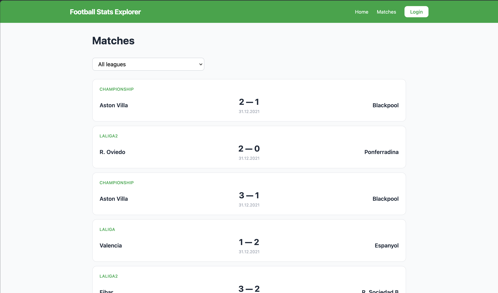
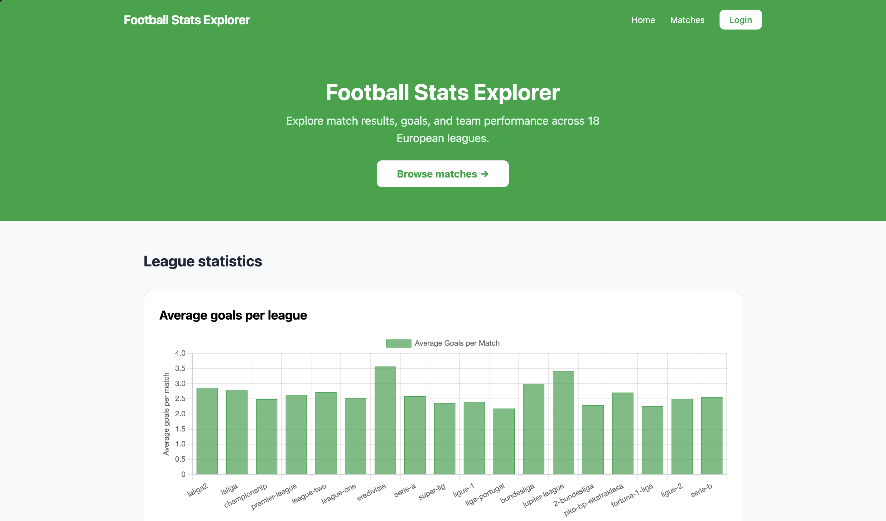
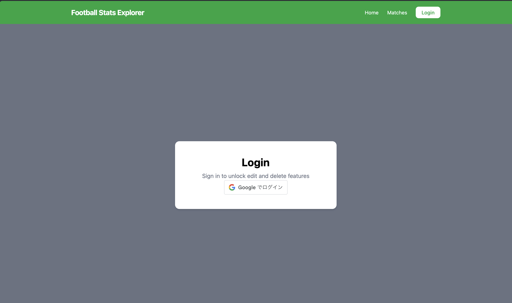
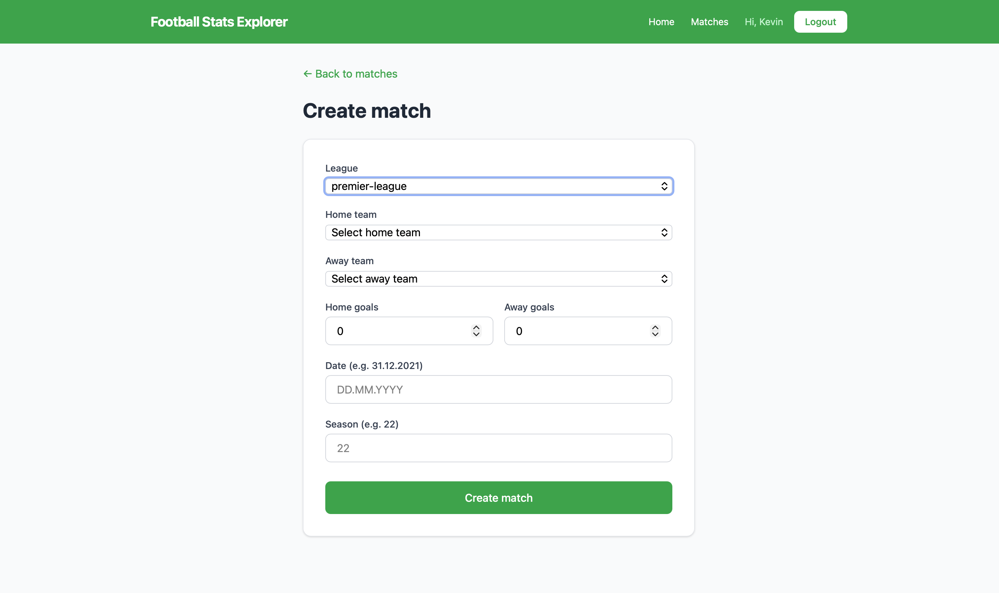
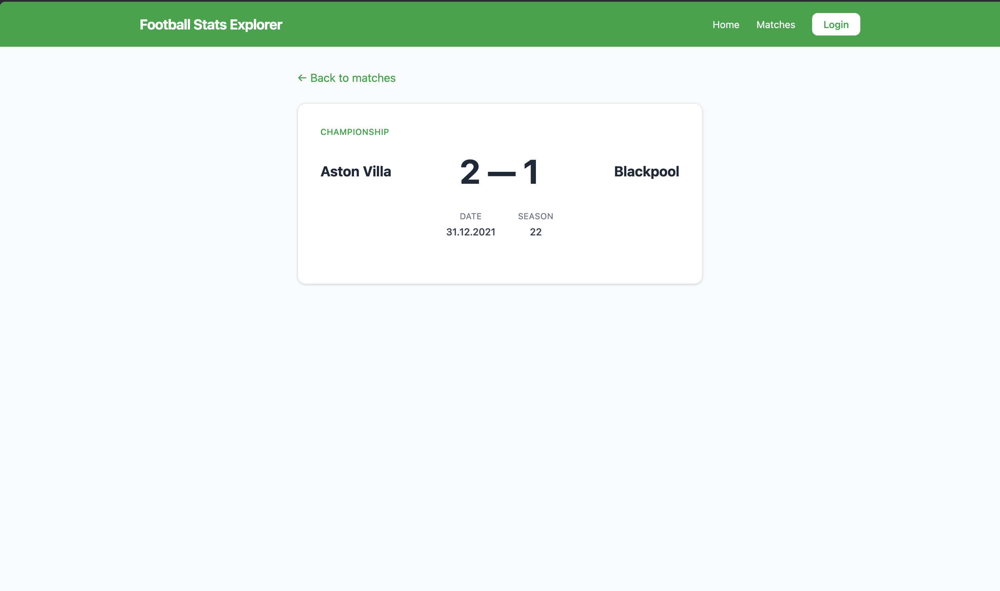

# Assignment WT - Web for Data Science

## Project Name

Football Stats Explorer

## Objective

Create a functional, visually engaging, and _interactive_ data visualization web application that consumes the API you built in the previous assignment. The application must authenticate users via OAuth and be publicly accessible.

Football Stats Explorer is an interactive data visualization web application that consumes a GraphQL API built with Node.js, Express, and PostgreSQL. The application visualizes over 89,000 football matches across 18 European leagues, providing insights into team performance, goals scored, and match results. Users can browse matches, filter by league, and view match statistics. Authenticated users can create, edit, and delete matches.

## Deployed Application

_Provide the link to your publicly accessible application:_

> URL: https://football-stats-explorer.vercel.app

## Requirements

See [all requirementsc in Issues](../../issues/). Close issues as you implement them. Create additional issues for any custom functionality.

### Functional Requirements

| Requirement                                                                        | Issue                  | Status               |
| ---------------------------------------------------------------------------------- | ---------------------- | -------------------- |
| API Integration — the app consumes your WT1 API                                    | [#14](../../issues/14) | :white_large_square: |
| OAuth Authentication — users log in via OAuth 2.0                                  | [#15](../../issues/15) | :white_large_square: |
| Interactive data visualization with aggregation/adaptation for 10 000+ data points | [#11](../../issues/11) | :white_large_square: |
| Efficient loading — pagination, lazy loading, loading indicators                   | [#13](../../issues/13) | :white_large_square: |

### Non-Functional Requirements

| Requirement                                   | Issue                | Status               |
| --------------------------------------------- | -------------------- | -------------------- |
| Clear and well-structured code                | [#1](../../issues/1) | :white_large_square: |
| Code reuse                                    | [#2](../../issues/2) | :white_large_square: |
| Dependency management and scripts             | [#3](../../issues/3) | :white_large_square: |
| Source code documentation                     | [#4](../../issues/4) | :white_large_square: |
| Coding standard                               | [#5](../../issues/5) | :white_large_square: |
| Examiner can follow the creation process      | [#6](../../issues/6) | :white_large_square: |
| Publicly accessible over the internet         | [#7](../../issues/7) | :white_large_square: |
| Keys and tokens handled correctly             | [#8](../../issues/8) | :white_large_square: |
| Complete assignment report with correct links | [#9](../../issues/9) | :white_large_square: |

### VG — AI/ML Feature (optional)

For a VG grade, integrate **one** AI/ML feature into the application. Pick one below or propose your own of similar scope. See the [VG issue](../../issues/12) for full details and acceptance criteria.

| Option                                                        | Status               |
| ------------------------------------------------------------- | -------------------- |
| Semantic Search — natural language queries matched by meaning | :white_large_square: |
| Content-Based Recommendations — "items similar to this one"   | :white_large_square: |
| Sentiment Analysis — analyze and visualize text sentiment     | :white_large_square: |
| Text Summarization / Generation — LLM-powered summaries       | :white_large_square: |
| Clustering & Grouping — auto-group similar items visually     | :white_large_square: |
| RAG — natural language Q&A grounded in your dataset           | :white_large_square: |
| Other: _describe_                                             | :white_large_square: |

_Describe your chosen AI/ML feature and how it integrates with your application:_

## Core Technologies Used

| Layer           | Choice                     | Reason                                                                                                        |
| --------------- | -------------------------- | ------------------------------------------------------------------------------------------------------------- |
| Visualization   | Chart.js + react-chartjs-2 | Chosen because it is beginner friendly and has lots of examples online. Easier to learn than D3.js            |
| Front-end       | React + Vite               | Chosen because it is the most popular frontend framework with a huge community and lots of learning resources |
| Styling         | Tailwind CSS               | Chosen because it removes the need to switch between files when styling. Everything stays in one place        |
| Routing         | React Router               | Chosen because it is the standard routing library for React and works out of the box with no extra setup      |
| Authentication  | @react-oauth/google        | Chosen because it handles all the complex OAuth logic behind the scenes so you only need a few lines of code  |
| HTTP Client     | Fetch API                  | Chosen because it is already built into every browser so there is no need to install an extra library         |
| Deployment      | Vercel                     | Chosen because it connects directly to GitHub and deploys automatically every time you push new code          |
| Code formatting | Prettier                   | Chosen because it formats all code automatically on save so you never have to worry about inconsistent style  |

The WT1 API that this frontend consumes is built with Node.js, Express, GraphQL, Prisma and PostgreSQL on Neon.tech.

## How to Use

## How to Use

### Browsing matches

- Go to the **Matches** page using the navbar
- You will see a list of 20 matches at a time
- Use the **league dropdown** at the top to filter matches by league
- Click **Load more matches** at the bottom to load the next 20 matches
- Click any match card to open the full match detail page

### Charts

- Go to the **Home** page to see all three charts
- **Average goals per league** — shows which leagues have the most goals per match on average
- **Top 10 wins per team** — use the league dropdown inside the chart to see which teams win the most in that league
- **Goals scored vs conceded** — use the league dropdown inside the chart to compare how many goals the top 10 teams scored versus how many they let in

### Logging in

- Click **Login** in the navbar
- Click **Sign in with Google** and choose your Google account
- After logging in you will see your name in the navbar
- Click **Logout** to log out and clear your session

### Creating a match (login required)

- Click **+ Create match** on the Matches page
- Select a league from the dropdown
- Select the home and away teams from the dropdowns that appear
- Enter the number of goals, the date and the season
- Click **Create match**

### Editing a match (login required)

- Click on any match card to open the detail page
- Click **Edit match**
- Change the goals or the date
- Click **Save changes**

.png>)

### Deleting a match (login required)

- Click on any match card to open the detail page
- Click **Delete match**
- Confirm the deletion in the popup

## Known Limitations

### OAuth implementation

The Google OAuth token exchange happens client-side rather than server-side. According to the assignment requirements a server-side component such as Next.js API routes or a small Express backend should handle the code exchange to keep the client secret secure. Due to time constraints this was not implemented. The Google Client Secret is stored in environment variables and never exposed to the browser. A future implementation would use Next.js to handle the code exchange server-side.

### Firefox compatibility

The Google OAuth login popup is blocked by Firefox on the live URL. This is because Firefox applies strict popup blocking rules on live websites. The login works correctly in Chrome and Safari. A fix would be to switch to `ux_mode="redirect"` in the Google login component, but this requires additional server-side setup.

### User accounts

All users who log in with Google are mapped to a unique account in the WT1 API using their Google email as the username and their Google ID as the password. This means each Google user gets their own account. However in a production system passwords would be handled more securely and users would not share the same API user type.

### Season filter

The dataset uses two-digit season numbers (e.g. "22") instead of full years. A season filter was considered but removed because the season numbers do not map cleanly to calendar years, which would have confused users.

## Acknowledgements

- Football dataset from [Kaggle](https://www.kaggle.com) — 89,000+ matches across 18 European leagues
- Charts built with [Chart.js](https://www.chartjs.org/) and [react-chartjs-2](https://react-chartjs-2.js.org/)
- Google OAuth login handled by [@react-oauth/google](https://www.npmjs.com/package/@react-oauth/google)
- Styling with [Tailwind CSS](https://tailwindcss.com/)
- Deployed on [Vercel](https://vercel.com)
- WT1 API built with Node.js, Express, GraphQL, Prisma and PostgreSQL on [Neon.tech](https://neon.tech)
- Routing with [React Router](https://reactrouter.com/)
- Code formatting with [Prettier](https://prettier.io/)
- Development environment: VS Code on macOS
